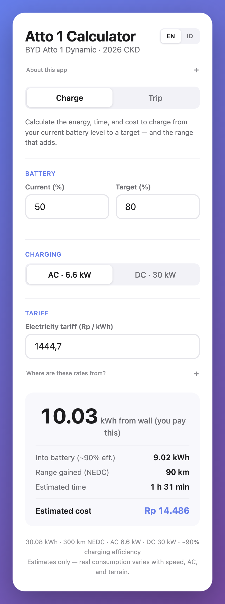
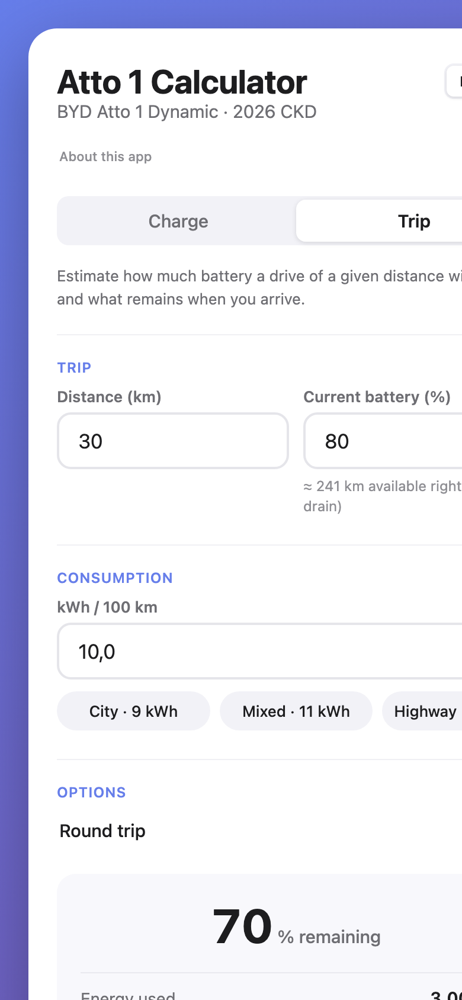

# ⚡ Atto 1 Calculator

<div align="center">

</div>

A tiny EV calculator for the **BYD Atto 1 Dynamic** (2026, CKD Indonesia) — 30.08 kWh, 300 km NEDC, AC 6.6 kW, DC 30 kW. It answers the two questions the car's own UI doesn't: **what a charge actually costs**, and **what's left in the battery after a trip**.

**Live:** [berrabe.github.io/atto1-calculator](https://berrabe.github.io/atto1-calculator/)

> [!TIP] Quick start
> Open the live URL in iPhone Safari → Share → **Add to Home Screen**. It runs full-screen and works **completely offline** after the first open.

> **📖 Table of Contents**
> - [1. 🎯 What & Why](#1-🎯-what--why)
> - [2. ⚡ Features](#2-⚡-features)
> - [3. 📱 Install on iPhone](#3-📱-install-on-iphone)
> - [4. 🔢 Assumptions & Tariff Sources](#4-🔢-assumptions--tariff-sources)
> - [5. 🧪 Self-Test](#5-🧪-self-test)
> - [6. 🛠️ Tech & Deploy](#6-🛠️-tech--deploy)

&nbsp;
&nbsp;
&nbsp;
&nbsp;
&nbsp;

# 1. 🎯 What & Why

---

The Atto 1 shows battery % and a trip computer, but it never tells you **how much charging will cost** or **how far you can actually go**. This app does that math — calmly, in two screens.

<div align="center">

| Charge | Trip |
|---|---|
|  |  |

</div>

&nbsp;
&nbsp;
&nbsp;

# 2. ⚡ Features

---

| Feature | What you get |
|---|---|
| **Charge planner** | kWh from the wall (what you pay) vs into the battery, range gained, charging time, and cost — AC 6.6 kW or DC 30 kW |
| **DC extras** | PBJT-TL tax + optional per-session service fee, matched to the real SPKLU invoice structure |
| **Trip planner** | Energy used, remaining %, remaining range, and a clear *enough / not enough* verdict — round-trip toggle included |
| **Real-world consumption** | Modeled in kWh/100 km (the unit the car shows): City 9 · Mixed 11 · Highway 14, or your own number |
| **English / Indonesian** | One-tap toggle, auto-detects browser language |
| **Offline PWA** | Install once, works forever without internet |

&nbsp;
&nbsp;
&nbsp;

# 3. 📱 Install on iPhone

---

1. Open [berrabe.github.io/atto1-calculator](https://berrabe.github.io/atto1-calculator/) in **Safari**
2. Share → **Add to Home Screen**
3. Open it from the Home Screen — full screen, no browser chrome

> [!TIP]
> The first open needs internet once (to cache). After that it runs even in airplane mode.

&nbsp;
&nbsp;
&nbsp;
&nbsp;
&nbsp;

# 4. 🔢 Assumptions & Tariff Sources

---

| Item | Default | Source |
|---|---|---|
| Battery | 30.08 kWh | Atto 1 Dynamic spec |
| Range | 300 km NEDC | Factory claim — 1% = 3 km |
| Charging efficiency | ~90% | Wall → battery losses |
| **AC / home tariff** | Rp1.444,70/kWh | PLN R-1/TR 1.300–2.200 VA, Q3 2026 (900 VA: Rp1.352 · 3.500+ VA: Rp1.699,53) |
| **DC / SPKLU tariff** | Rp2.466,78/kWh | ESDM "Layanan Khusus" rate — flat, day & night |
| **PBJT-TL** | 8% (editable) | Local electricity tax — varies 0–9% per region/transaction |
| **Service fee / session** | Rp0 (hidden) | PLN SPKLU charges none; third-party operators may — tap **+ Service fee** in DC mode |

> [!NOTE]
> The DC numbers are **verified from 6 real PLN invoices** (Sep 2026): the rate matched exactly on all 6, and PBJT-TL was observed at 0, 4, 6, 8, 8, and 9%. In-app ⓘ tooltips carry the same sources — and every number is editable.

&nbsp;
&nbsp;
&nbsp;
&nbsp;
&nbsp;

# 5. 🧪 Self-Test

---

Append `?test=1` to the URL — a 15-assertion suite runs and shows a pass/fail banner inline, including a regression test that replays a real SPKLU invoice:

```
14.452 kWh @ Rp2.466,78 + 8% PBJT = Rp38.502 ✓
```

&nbsp;
&nbsp;
&nbsp;
&nbsp;
&nbsp;

# 6. 🛠️ Tech & Deploy

---

| | |
|---|---|
| Files | `index.html` (~950 lines) + `sw.js` (offline cache) |
| Stack | Vanilla HTML/CSS/JS — zero dependencies, zero build step, no CDN |
| State | `localStorage` — language, charger, tariffs, last inputs |
| Hosting | GitHub Pages — `main` / root |
| Deep links | `?tab=trip` opens the Trip tab · `?test=1` runs the self-test |

Deploy = `git push`.

> [!WARNING]
> Shipping an update to already-installed phones? Bump the `CACHE` version in `sw.js` first — otherwise the service worker keeps serving the old files.
